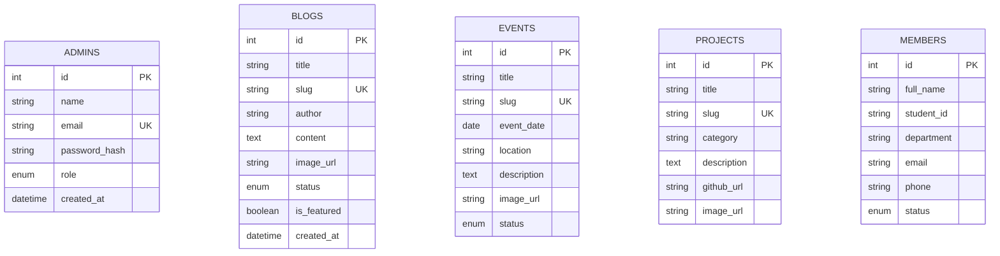

<div align="center">

# ⚡ HACK KUET Web Portal & Admin CMS

**Official Web Application for the Hardware Acceleration Club of KUET (HACK KUET)**

[](https://php.net)
[](https://mysql.com)
[](https://developer.mozilla.org/)
[](LICENSE)

[Features](#-key-features) • [Tech Stack](#-tech-stack) • [Installation](#-getting-started) • [Admin Suite](#-admin-dashboard--cms) • [Architecture](#-project-structure) • [Database](#-database-schema)

</div>

---

## 📖 Overview

**HACK KUET** (Hardware Acceleration Club of KUET) is the premier hardware, robotics, embedded systems, and firmware innovation club at **Khulna University of Engineering & Technology (KUET)**. 

This repository powers the official club platform: a high-performance **PHP & MySQL** web portal featuring an interactive public showcase and a feature-complete **Admin Content Management System (CMS)**.

---

## ✨ Key Features

### 🌐 Public Portal (`/`)
- 🤖 **Projects Showcase**: Interactive catalog featuring robotics rovers, PCB review checklists, PID tuning guides, smart canes, and IoT solutions (`project.php`, `project-detail.php`).
- 📅 **Events & Workshops**: Comprehensive agenda for workshops, technical seminars, hackathons, and project showcases (`event.php`, `activity-detail.php`).
- ✍️ **Tech Blogs & Publications**: Knowledge sharing hub covering microcontroller mistakes, firmware architecture, UART/HTTP protocols, and sensor debugging (`blogs.php`, `blog-detail.php`).
- 📥 **Blog Submission**: Member submission pipeline for technical articles (`blog-submit.php`).
- 🎓 **Membership Application**: Online registration form for KUET students joining the club (`membership.php`).
- ✉️ **Contact & Feedback**: Direct inquiry form integrated with admin notification inbox (`contact.php`, `contact-submit.php`).
- 🌓 **Dynamic Theme Switcher**: Modern cyber/dark aesthetics with smooth light/dark mode toggling (`theme-toggle.js`).

---

### 🛡️ Admin Dashboard & CMS (`/admin`)
- 🔐 **Secure Authentication**: BCrypt password hashing (`password_hash`), session control, and role-based authorization (`admin/login.php`, `admin/includes/auth.php`).
- 🚀 **1-Click Web Installer**: Automated initialization script (`admin/setup.php`) that configures MySQL databases, executes SQL schemas, seeds default content, and sets up super-admin access.
- 📊 **Overview Analytics**: Real-time counters for total blogs, active projects, upcoming events, student applications, and unread messages.
- 🛠️ **Module Management**:
  - **Blog Manager**: Review, approve, feature, publish, or edit submitted blog posts.
  - **Event Manager**: Create and organize upcoming workshops and club events with cover banners.
  - **Project Manager**: Manage showcase hardware projects, GitHub links, and technical specifications.
  - **Executive & Member Directory**: Manage the executive committee panel and member list.
  - **Contact Inbox**: Read, filter, and archive visitor messages.
- 🖼️ **Media Upload Handler**: Automatic file validation and storage management (`admin/uploads/`).

---

## 🛠 Tech Stack

| Domain | Technologies Used |
| :--- | :--- |
| **Frontend** | HTML5, CSS3 (Custom Cyber/Neo-Brutalist Tokens), JavaScript (ES6+), FontAwesome, Google Fonts (*Space Grotesk*, *Inter*) |
| **Backend** | PHP 8.x (PDO MySQL with Prepared Statements, Session Management) |
| **Database** | MySQL / MariaDB (`utf8mb4_unicode_ci`) |
| **Tooling & Environment** | XAMPP / Apache / PHP CLI, Git |

---

## 🚀 Getting Started

### Prerequisites

Ensure you have the following installed on your local machine:
- **PHP 8.0+** (with `pdo_mysql` extension enabled)
- **MySQL / MariaDB 8.0+** (or **XAMPP / WAMP / MAMP**)
- **Git**

---

### Installation & Setup

#### Option 1: Automated Setup via Web Installer (Recommended)

1. **Clone the repository**:
   ```bash
   git clone https://github.com/Fariha127/Hack-Club.git
   cd Hack-Club
   ```

2. **Start the local server**:
   - **Using PHP Built-in Server**:
     ```bash
     php -S localhost:8000
     ```
   - **Using XAMPP**: Place the project inside your `xampp/htdocs/` folder (e.g., `C:\xampp\htdocs\Hack-Club`) and start Apache & MySQL from the XAMPP Control Panel.

3. **Run the 1-Click Installer**:
   Open your browser and navigate to:
   ```text
   http://localhost:8000/admin/setup.php
   ```
   *(Or `http://localhost/Hack-Club/admin/setup.php` if using XAMPP)*

4. **Initialize Database**:
   - Provide your MySQL connection credentials (e.g., Host: `localhost`, User: `root`, Password: ``).
   - Enter your desired Super-Admin credentials.
   - Click **Run Setup**. The installer will create the `hack_kuet` database, execute all DDL schemas, seed default data, and write the `admin/includes/config.php` file automatically!

> [!IMPORTANT]
> Delete or rename `admin/setup.php` after completing the setup for security.

---

#### Option 2: Manual Database Setup

If you prefer setting up MySQL manually:

1. **Create the database**:
   ```sql
   CREATE DATABASE IF NOT EXISTS `hack_kuet` CHARACTER SET utf8mb4 COLLATE utf8mb4_unicode_ci;
   ```

2. **Import the SQL Schemas**:
   Import the schema and seed files into MySQL via phpMyAdmin or CLI:
   ```bash
   mysql -u root -p hack_kuet < database/schema.sql
   mysql -u root -p hack_kuet < database/blog_seed_content.sql
   mysql -u root -p hack_kuet < database/event_seed_content.sql
   mysql -u root -p hack_kuet < database/activity_seed_content.sql
   ```

3. **Configure Database Connection**:
   Create or verify [`admin/includes/config.php`](file:///f:/Projects/Hack-Club/admin/includes/config.php):
   ```php
   <?php
   define('DB_HOST', 'localhost');
   define('DB_NAME', 'hack_kuet');
   define('DB_USER', 'root');
   define('DB_PASS', '');
   define('DB_CHARSET', 'utf8mb4');
   define('UPLOAD_BASE_DIR', dirname(__DIR__) . '/uploads/');
   define('MAX_UPLOAD_SIZE', 5 * 1024 * 1024);
   define('SESSION_TIMEOUT', 3600);
   ```

---

## 📁 Project Structure

```text
Hack-Club/
├── admin/                      # Admin Dashboard & Management Suite
│   ├── api/                    # RESTful PHP API controllers (blogs, events, projects, members, etc.)
│   ├── css/                    # Dedicated Admin Dashboard stylesheet (admin.css)
│   ├── includes/               # DB connection, configuration, auth, and global helpers
│   │   ├── auth.php            # Session validation & route protection
│   │   ├── config.php          # Database and environment constants
│   │   ├── db.php              # PDO Database singleton connection
│   │   └── functions.php       # Utility functions (sanitization, upload helpers)
│   ├── js/                     # Admin dynamic AJAX and DOM interaction scripts (admin.js)
│   ├── modules/                # Admin CRUD Management Interfaces
│   │   ├── blogs.php           # Blog post moderation & publisher
│   │   ├── contact.php         # Contact message inbox manager
│   │   ├── events.php          # Workshop & event manager
│   │   ├── executives.php      # Executive committee manager
│   │   ├── members.php         # Club membership applications manager
│   │   └── projects.php        # Hardware project showcase manager
│   ├── uploads/                # Dynamic media uploads (blogs, projects, events)
│   ├── dashboard.php           # Main admin stats & summary view
│   ├── index.php               # Admin router entry point
│   ├── login.php               # Admin authentication page
│   ├── logout.php              # Session termination script
│   └── setup.php               # Web-based database installer
├── database/                   # Relational Database Assets
│   ├── schema.sql              # Complete MySQL DDL schema
│   ├── activity_seed_content.sql # Initial club activity seed content
│   ├── blog_seed_content.sql   # Initial technical blogs seed content
│   └── event_seed_content.sql  # Initial event records seed content
├── about.php                   # Club history, vision, and team details
├── activity-detail.php         # Event/activity detail page
├── blog-detail.php             # Individual blog post viewer
├── blog-submit.php             # Member blog submission form
├── blogs.php                   # Technical blogs listing grid
├── contact-submit.php          # Contact form processor
├── contact.php                 # Contact details & inquiry page
├── event.php                   # Upcoming & past events directory
├── home.php                    # Main public website homepage
├── membership.php              # Student membership application form
├── project-detail.php          # Individual project showcase page
├── project.php                 # Hardware projects listing grid
├── public-data.php             # Public data fetch helpers
├── style.css                   # Master Cyberpunk/Modern CSS Design System
├── main.js                     # Core site interactivity & mobile menu
├── theme-toggle.js             # Dark/Light theme switcher
└── README.md                   # Project documentation
```

---

## 🗄 Database Schema

The system relies on a relational MySQL structure:



---

## 🤝 Contributing

Contributions from KUET students, hardware enthusiasts, and open-source developers are welcome!

1. Fork the repository
2. Create your feature branch (`git checkout -b feature/AwesomeHardwareFeature`)
3. Commit your changes (`git commit -m 'Add some AwesomeHardwareFeature'`)
4. Push to the branch (`git push origin feature/AwesomeHardwareFeature`)
5. Open a Pull Request

---

## 📜 License

Distributed under the MIT License. See `LICENSE` for more information.

---

<div align="center">
Made with ❤️ by <b>HACK KUET (Hardware Acceleration Club of KUET)</b>
</div>
